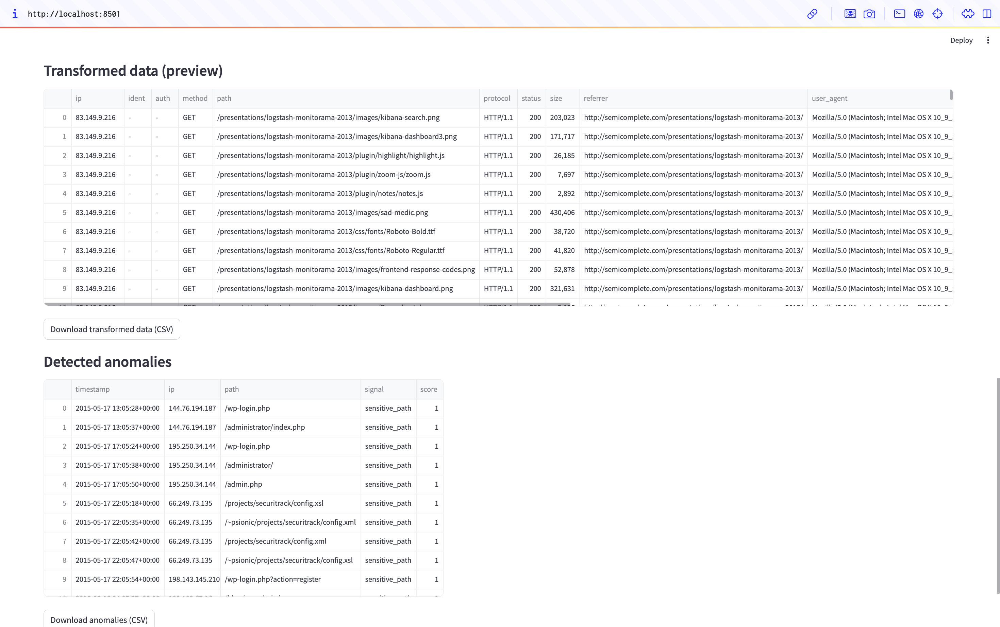

# Data Pipeline & Monitoring Dashboard

[](https://data-pipeline-monitoring-dashboard.streamlit.app/)
[](https://www.python.org/)
  
🔗 **Live Demo:** [data-pipeline-monitoring-dashboard.streamlit.app](https://data-pipeline-monitoring-dashboard.streamlit.app/)


A **hands-on data engineering & monitoring project** built with **Python, Pandas, and Streamlit**.  
It simulates an end-to-end workflow: from raw log ingestion and cleaning to **anomaly detection** and a **monitoring dashboard** with key metrics.  
The goal is to **learn by doing** and practice how each part connects in a clear, maintainable way.

---

## 🚀 Live Demo & Deployment

The app is deployed on **Streamlit Community Cloud** and publicly accessible here:

👉 **[Launch the Dashboard](https://data-pipeline-monitoring-dashboard.streamlit.app/)**

---

## Project Overview

The **Data Pipeline & Monitoring Dashboard** is a small internal tool that:

-  Ingests raw **Apache/Nginx log files** (or any text-based log dataset)
-  Cleans and transforms the data into structured form (with Pandas)
-  Detects anomalies and suspicious activity using simple logic rules
- **Monitors key metrics** (error rate, requests/hour, top IPs, status breakdown)
-  Displays insights and statistics in an interactive Streamlit dashboard

It’s inspired by the type of workflow used in **data, cyber, or DevOps teams**, but simplified to show core concepts clearly.

---


## 📊 Dashboard Preview

<div align="center">

🧩 **Streamlit interface preview**

| Upload view | Dashboard overview |
|--------------|-------------------|
|  |  |

| Charts | Detected anomalies |
|--------|--------------------|
|  |  |

</div>

_The dataset used for this demo is a sample log file (non-sensitive, for testing purposes only)._


---


##  Why I Built This Project

I wanted to build a small project that helps me **practice how data pipelines work end-to-end** from ingestion to visualization.  
It was also an opportunity to write clean, modular Python code and create a simple dashboard for non-technical users.  
Through it, I strengthened my skills in **Pandas**, **Streamlit**, and **data transformation**, while learning how to structure a clear and maintainable data workflow.


---

## ⚙️ Tech Stack

| Category | Tools / Libraries |
|-----------|--------------------|
| Language | Python 3.10+ |
| Data manipulation | Pandas, NumPy |
| Dashboard | Streamlit, Altair |
| Data storage | CSV files (local) |
| Automation | Python scripts (CLI) |


---

## How the Pipeline Works

1️ **Ingestion** : Reads `.log` file, extracts key fields (IP, timestamp, path, status...).  
2️ **Transformation** : Converts to clean DataFrame (adds time columns, categories...).  
3️ **Detection** : Finds bursts of failed requests, sensitive path access, high request volumes.  
4️ **Visualization** : Interactive dashboard with charts & key metrics.

---

##  How to Run Locally

### 1. Clone the repo
```bash
git clone https://github.com/SleimaD/Data-Pipeline-Dashboard.git
cd Data-Pipeline-Dashboard
```

### 2. Create and activate a virtual environment
```bash
python -m venv venv
source venv/bin/activate    # On macOS/Linux
# or
venv\Scripts\activate       # On Windows
```

### 3. Install dependencies
```bash
pip install -r requirements.txt
```

### 4. Run the pipeline 
```bash
python run_pipeline.py -i data/sample_access.log -o data
```
This command will create two new CSV files:
- `data/processed.csv` → cleaned and structured data
- `data/findings.csv` → detected anomalies

### 5. Launch the dashboard
```bash
streamlit run app.py
```
Then open the link shown in the terminal and:
- Upload your own `.log` file (Apache/Nginx format)
- Explore the metrics and visual charts

---

## Features

**Log ingestion** — supports `.log` or `.txt`  
**Data transformation** — timestamp parsing, numeric cleanup, derived columns  
**Anomaly detection** — bursts of 401/403, access to sensitive paths, unusually high request volume  
**Monitoring dashboard (Streamlit)** — requests/hour, HTTP status breakdown, top IPs, error rate, downloads for processed data & findings

---


💬 Feel free to share feedback or ideas for improvement!

- 💻 GitHub: [SleimaD](https://github.com/SleimaD)
- 🔗 LinkedIn: [Sleima Ducros](https://linkedin.com/in/sleima-ducros)

